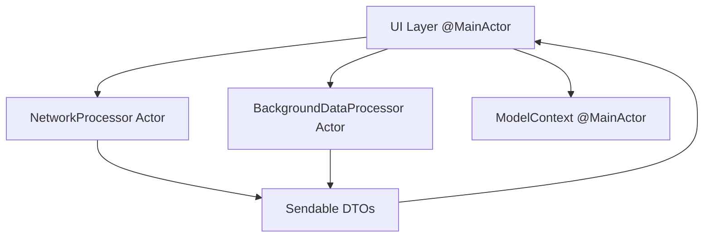

# Actor Isolation Strategy - Phase 2

**Purpose**: Define actor architecture and Sendable DTOs for Bridget app concurrency
**Phase**: 2 of 8 - Actor Isolation Strategy
**Status**: In Progress

---

## Executive Summary

This document defines the actor isolation strategy for the Bridget app, addressing the concurrency issues identified in Phase 1. The strategy establishes clear actor boundaries, defines Sendable Data Transfer Objects (DTOs), and plans actor communication patterns to ensure thread safety and prevent data races.

### Key Objectives
- **Actor Architecture**: Design proper actor boundaries and responsibilities
- **Sendable DTOs**: Create thread-safe data transfer objects
- **Communication Patterns**: Define message passing between actors
- **Error Propagation**: Plan error handling across actor boundaries

---

## Actor Architecture Design

### Actor Boundaries and Responsibilities

#### @MainActor - UI and ModelContext Operations
```swift
@MainActor
class BridgetApp: App {
    // UI operations only
    // ModelContext access
    // SwiftData transactions
}

@MainActor
class OpenSeattleAPIService: ObservableObject {
    // UI state management (@Published properties)
    // Coordination with NetworkProcessor actor
    // ModelContext operations
}

@MainActor
class DataManager: Observable {
    // Service coordination
    // ModelContext operations
    // UI state updates
}

@MainActor
class ServiceLayer {
    // All service classes with ModelContext access
    // DrawbridgeEventService, RouteService, etc.
}
```

#### NetworkProcessor Actor - Network Operations
```swift
actor NetworkProcessor {
    // All network operations
    // Data fetching from APIs
    // Data transformation
    // Error handling for network issues
}
```

#### BackgroundDataProcessor Actor - Heavy Processing
```swift
actor BackgroundDataProcessor {
    // Heavy data processing
    // Statistical analysis
    // Data synchronization coordination
    // Background cleanup operations
}
```

### Actor Communication Flow



#### Communication Patterns
1. **UI → NetworkProcessor**: Request data fetching
2. **NetworkProcessor → UI**: Return Sendable DTOs
3. **UI → BackgroundDataProcessor**: Request heavy processing
4. **BackgroundDataProcessor → UI**: Return processed results
5. **UI → ModelContext**: Direct access for data persistence

---

## Sendable DTO Design

### Core DTOs for Actor Communication

#### BridgeEventDTO
```swift
public struct BridgeEventDTO: Sendable, Codable, Identifiable {
    public let id: UUID
    public let entityID: String
    public let entityName: String
    public let entityType: String
    public let bridgeID: UUID // Reference to bridge
    public let openDateTime: Date
    public let closeDateTime: Date?
    public let minutesOpen: Double
    public let latitude: Double
    public let longitude: Double
    public let createdAt: Date
    public let updatedAt: Date
    
    public init(from event: DrawbridgeEvent) {
        self.id = event.id
        self.entityID = event.entityID
        self.entityName = event.entityName
        self.entityType = event.entityType
        self.bridgeID = event.bridge.id
        self.openDateTime = event.openDateTime
        self.closeDateTime = event.closeDateTime
        self.minutesOpen = event.minutesOpen
        self.latitude = event.latitude
        self.longitude = event.longitude
        self.createdAt = event.createdAt
        self.updatedAt = event.updatedAt
    }
    
    public init(
        id: UUID = UUID(),
        entityID: String,
        entityName: String,
        entityType: String,
        bridgeID: UUID,
        openDateTime: Date,
        closeDateTime: Date? = nil,
        minutesOpen: Double = 0.0,
        latitude: Double,
        longitude: Double,
        createdAt: Date = Date(),
        updatedAt: Date = Date()
    ) {
        self.id = id
        self.entityID = entityID
        self.entityName = entityName
        self.entityType = entityType
        self.bridgeID = bridgeID
        self.openDateTime = openDateTime
        self.closeDateTime = closeDateTime
        self.minutesOpen = minutesOpen
        self.latitude = latitude
        self.longitude = longitude
        self.createdAt = createdAt
        self.updatedAt = updatedAt
    }
}
```

#### BridgeInfoDTO
```swift
public struct BridgeInfoDTO: Sendable, Codable, Identifiable {
    public let id: UUID
    public let entityID: String
    public let entityName: String
    public let entityType: String
    public let latitude: Double
    public let longitude: Double
    public let createdAt: Date
    public let updatedAt: Date
    
    public init(from bridge: DrawbridgeInfo) {
        self.id = bridge.id
        self.entityID = bridge.entityID
        self.entityName = bridge.entityName
        self.entityType = bridge.entityType
        self.latitude = bridge.latitude
        self.longitude = bridge.longitude
        self.createdAt = bridge.createdAt
        self.updatedAt = bridge.updatedAt
    }
    
    public init(
        id: UUID = UUID(),
        entityID: String,
        entityName: String,
        entityType: String,
        latitude: Double,
        longitude: Double,
        createdAt: Date = Date(),
        updatedAt: Date = Date()
    ) {
        self.id = id
        self.entityID = entityID
        self.entityName = entityName
        self.entityType = entityType
        self.latitude = latitude
        self.longitude = longitude
        self.createdAt = createdAt
        self.updatedAt = updatedAt
    }
}
```

#### RouteDTO
```swift
public struct RouteDTO: Sendable, Codable, Identifiable {
    public let id: UUID
    public let name: String
    public let startLocation: String
    public let endLocation: String
    public let bridges: [String] // Bridge IDs
    public let isFavorite: Bool
    public let createdAt: Date
    public let updatedAt: Date
    
    public init(from route: Route) {
        self.id = route.id
        self.name = route.name
        self.startLocation = route.startLocation
        self.endLocation = route.endLocation
        self.bridges = route.bridges
        self.isFavorite = route.isFavorite
        self.createdAt = route.createdAt
        self.updatedAt = route.updatedAt
    }
    
    public init(
        id: UUID = UUID(),
        name: String,
        startLocation: String,
        endLocation: String,
        bridges: [String] = [],
        isFavorite: Bool = false,
        createdAt: Date = Date(),
        updatedAt: Date = Date()
    ) {
        self.id = id
        self.name = name
        self.startLocation = startLocation
        self.endLocation = endLocation
        self.bridges = bridges
        self.isFavorite = isFavorite
        self.createdAt = createdAt
        self.updatedAt = updatedAt
    }
}
```

#### TrafficFlowDTO
```swift
public struct TrafficFlowDTO: Sendable, Codable, Identifiable {
    public let id: UUID
    public let bridgeID: String
    public let timestamp: Date
    public let congestionLevel: Double
    public let trafficVolume: Double
    public let correlationScore: Double
    
    public init(from flow: TrafficFlow) {
        self.id = flow.id
        self.bridgeID = flow.bridgeID
        self.timestamp = flow.timestamp
        self.congestionLevel = flow.congestionLevel
        self.trafficVolume = flow.trafficVolume
        self.correlationScore = flow.correlationScore
    }
    
    public init(
        id: UUID = UUID(),
        bridgeID: String,
        timestamp: Date = Date(),
        congestionLevel: Double,
        trafficVolume: Double,
        correlationScore: Double = 0.0
    ) {
        self.id = id
        self.bridgeID = bridgeID
        self.timestamp = timestamp
        self.congestionLevel = congestionLevel
        self.trafficVolume = trafficVolume
        self.correlationScore = correlationScore
    }
}
```

### Bulk Data DTOs

#### SyncDataDTO
```swift
public struct SyncDataDTO: Sendable, Codable {
    public let bridges: [BridgeInfoDTO]
    public let events: [BridgeEventDTO]
    public let routes: [RouteDTO]
    public let trafficFlows: [TrafficFlowDTO]
    public let syncTimestamp: Date
    public let source: String
    
    public init(
        bridges: [BridgeInfoDTO] = [],
        events: [BridgeEventDTO] = [],
        routes: [RouteDTO] = [],
        trafficFlows: [TrafficFlowDTO] = [],
        syncTimestamp: Date = Date(),
        source: String = "api"
    ) {
        self.bridges = bridges
        self.events = events
        self.routes = routes
        self.trafficFlows = trafficFlows
        self.syncTimestamp = syncTimestamp
        self.source = source
    }
}
```

#### NetworkResponseDTO
```swift
public struct NetworkResponseDTO: Sendable, Codable {
    public let success: Bool
    public let data: Data?
    public let error: String?
    public let timestamp: Date
    public let endpoint: String
    
    public init(
        success: Bool,
        data: Data? = nil,
        error: String? = nil,
        timestamp: Date = Date(),
        endpoint: String
    ) {
        self.success = success
        self.data = data
        self.error = error
        self.timestamp = timestamp
        self.endpoint = endpoint
    }
}
```

---

## Actor Communication Patterns

### Message Passing Design

#### NetworkProcessor Messages
```swift
// Messages sent to NetworkProcessor
enum NetworkProcessorMessage: Sendable {
    case fetchBridgeData(limit: Int, offset: Int)
    case fetchEventData(limit: Int, offset: Int)
    case fetchTrafficData(bridgeID: String?)
    case validateConnection
}

// Responses from NetworkProcessor
enum NetworkProcessorResponse: Sendable {
    case bridgeData([BridgeInfoDTO])
    case eventData([BridgeEventDTO])
    case trafficData([TrafficFlowDTO])
    case connectionStatus(Bool)
    case error(String)
}
```

#### BackgroundDataProcessor Messages
```swift
// Messages sent to BackgroundDataProcessor
enum BackgroundProcessorMessage: Sendable {
    case processSyncData(SyncDataDTO)
    case cleanupOldData(olderThan: Date)
    case analyzeTrafficPatterns(bridgeID: String)
    case generateStatistics
}

// Responses from BackgroundDataProcessor
enum BackgroundProcessorResponse: Sendable {
    case syncComplete(SyncDataDTO)
    case cleanupComplete(Int) // Number of records deleted
    case analysisComplete(TrafficAnalysisDTO)
    case statisticsComplete(StatisticsDTO)
    case error(String)
}
```

### Error Propagation Strategy

#### Error Types
```swift
public enum ActorError: Sendable, LocalizedError {
    case networkError(String)
    case dataError(String)
    case processingError(String)
    case validationError(String)
    
    public var errorDescription: String? {
        switch self {
        case .networkError(let message):
            return "Network error: \(message)"
        case .dataError(let message):
            return "Data error: \(message)"
        case .processingError(let message):
            return "Processing error: \(message)"
        case .validationError(let message):
            return "Validation error: \(message)"
        }
    }
}
```

#### Error Handling Flow
```swift
// Error propagation pattern
@MainActor
class ErrorHandler {
    func handleError(_ error: ActorError) {
        switch error {
        case .networkError(let message):
            // Show network error to user
            showNetworkError(message)
        case .dataError(let message):
            // Show data error to user
            showDataError(message)
        case .processingError(let message):
            // Show processing error to user
            showProcessingError(message)
        case .validationError(let message):
            // Show validation error to user
            showValidationError(message)
        }
    }
}
```

---

## Implementation Strategy

### Phase 2 Implementation Plan

#### Step 1: Create DTO Package Structure
```swift
// Packages/BridgetCore/Sources/BridgetCore/DTOs/
├── BridgeEventDTO.swift
├── BridgeInfoDTO.swift
├── RouteDTO.swift
├── TrafficFlowDTO.swift
├── SyncDataDTO.swift
├── NetworkResponseDTO.swift
└── ActorMessages.swift
```

#### Step 2: Create Conversion Utilities
```swift
// Packages/BridgetCore/Sources/BridgetCore/Utilities/ModelConversion.swift
public extension DrawbridgeEvent {
    func toDTO() -> BridgeEventDTO {
        BridgeEventDTO(from: self)
    }
}

public extension DrawbridgeInfo {
    func toDTO() -> BridgeInfoDTO {
        BridgeInfoDTO(from: self)
    }
}

public extension BridgeEventDTO {
    func toModel(in context: ModelContext, bridge: DrawbridgeInfo) -> DrawbridgeEvent {
        DrawbridgeEvent(
            id: id,
            entityID: entityID,
            entityName: entityName,
            entityType: entityType,
            bridge: bridge,
            openDateTime: openDateTime,
            closeDateTime: closeDateTime,
            minutesOpen: minutesOpen,
            latitude: latitude,
            longitude: longitude
        )
    }
}
```

#### Step 3: Design Actor Interfaces
```swift
// Actor protocol definitions
protocol NetworkProcessing {
    func fetchBridgeData(limit: Int, offset: Int) async throws -> [BridgeInfoDTO]
    func fetchEventData(limit: Int, offset: Int) async throws -> [BridgeEventDTO]
    func validateConnection() async throws -> Bool
}

protocol BackgroundProcessing {
    func processSyncData(_ data: SyncDataDTO) async throws -> SyncDataDTO
    func cleanupOldData(olderThan: Date) async throws -> Int
    func analyzeTrafficPatterns(bridgeID: String) async throws -> TrafficAnalysisDTO
}
```

### Actor Coordination Patterns

#### Sequential Processing
```swift
@MainActor
class DataCoordinator {
    private let networkProcessor: NetworkProcessor
    private let backgroundProcessor: BackgroundDataProcessor
    
    func performFullSync() async throws {
        // 1. Fetch data from network
        let bridgeData = try await networkProcessor.fetchBridgeData(limit: 1000, offset: 0)
        let eventData = try await networkProcessor.fetchEventData(limit: 1000, offset: 0)
        
        // 2. Process data in background
        let syncData = SyncDataDTO(bridges: bridgeData, events: eventData)
        let processedData = try await backgroundProcessor.processSyncData(syncData)
        
        // 3. Apply to ModelContext
        try await applyToModelContext(processedData)
    }
}
```

#### Parallel Processing
```swift
@MainActor
class ParallelDataCoordinator {
    func performParallelSync() async throws {
        // Parallel data fetching
        async let bridgeData = networkProcessor.fetchBridgeData(limit: 1000, offset: 0)
        async let eventData = networkProcessor.fetchEventData(limit: 1000, offset: 0)
        async let trafficData = networkProcessor.fetchTrafficData(bridgeID: nil)
        
        // Wait for all to complete
        let (bridges, events, traffic) = try await (bridgeData, eventData, trafficData)
        
        // Process together
        let syncData = SyncDataDTO(bridges: bridges, events: events, trafficFlows: traffic)
        let processedData = try await backgroundProcessor.processSyncData(syncData)
        
        // Apply to ModelContext
        try await applyToModelContext(processedData)
    }
}
```

---

## Performance Considerations

### Actor Performance Optimization

#### Actor Pooling Strategy
```swift
// Reuse actors for better performance
actor NetworkProcessorPool {
    private var processors: [NetworkProcessor] = []
    private let maxProcessors = 3
    
    func getProcessor() -> NetworkProcessor {
        if let processor = processors.popLast() {
            return processor
        }
        return NetworkProcessor()
    }
    
    func returnProcessor(_ processor: NetworkProcessor) {
        if processors.count < maxProcessors {
            processors.append(processor)
        }
    }
}
```

#### Batch Processing
```swift
// Batch operations for efficiency
actor BatchProcessor {
    func processBatch<T: Sendable>(_ items: [T], batchSize: Int = 100) async throws -> [ProcessedItem] {
        var results: [ProcessedItem] = []
        
        for i in stride(from: 0, to: items.count, by: batchSize) {
            let batch = Array(items[i..<min(i + batchSize, items.count)])
            let batchResults = try await processBatch(batch)
            results.append(contentsOf: batchResults)
        }
        
        return results
    }
}
```

---

## Testing Strategy

### Actor Testing Patterns

#### Actor Isolation Testing
```swift
@MainActor
final class ActorIsolationTests: XCTestCase {
    func testActorBoundaryCrossing() async throws {
        let networkProcessor = NetworkProcessor()
        
        // Test that DTOs can cross actor boundaries
        let bridgeDTO = BridgeInfoDTO(
            entityID: "test-bridge",
            entityName: "Test Bridge",
            entityType: "drawbridge",
            latitude: 47.6062,
            longitude: -122.3321
        )
        
        // This should compile without Sendable errors
        let _: BridgeInfoDTO = await networkProcessor.processBridgeDTO(bridgeDTO)
    }
    
    func testModelContextIsolation() async throws {
        let bridge = DrawbridgeInfo(
            entityID: "test",
            entityName: "Test",
            entityType: "drawbridge",
            latitude: 0,
            longitude: 0
        )
        
        // This should work (MainActor)
        modelContext.insert(bridge)
        
        // This should not compile (crossing actor boundary)
        // await networkProcessor.insertBridge(bridge) // Should fail
    }
}
```

#### Concurrency Testing
```swift
@MainActor
final class ConcurrencyTests: XCTestCase {
    func testConcurrentDataAccess() async throws {
        // Test concurrent access to data
        async let task1 = dataManager.synchronizeData(forceRefresh: true)
        async let task2 = dataManager.synchronizeData(forceRefresh: false)
        
        // Both should complete without data races
        try await (task1, task2)
    }
    
    func testActorCommunication() async throws {
        let networkProcessor = NetworkProcessor()
        let backgroundProcessor = BackgroundDataProcessor()
        
        // Test actor communication
        let bridgeData = try await networkProcessor.fetchBridgeData(limit: 10, offset: 0)
        let syncData = SyncDataDTO(bridges: bridgeData)
        let processedData = try await backgroundProcessor.processSyncData(syncData)
        
        XCTAssertEqual(processedData.bridges.count, bridgeData.count)
    }
}
```

---

## Success Criteria for Phase 2

### Completed Tasks
- [x] **Design Actor Boundaries**: Clear actor architecture defined
- [x] **Define Sendable DTOs**: All DTOs designed and documented
- [x] **Plan Actor Communication**: Message passing patterns established
- [x] **Design DTO Conversion Utilities**: Conversion utilities planned
- [x] **Plan Error Propagation**: Error handling strategy defined
- [x] **Design Transaction Coordination**: Transaction patterns established

### Deliverables
- [x] **Actor Architecture**: Complete actor boundary design
- [x] **Sendable DTOs**: All DTOs defined with proper conformance
- [x] **Communication Patterns**: Message passing and coordination patterns
- [x] **Error Handling**: Comprehensive error propagation strategy
- [x] **Testing Strategy**: Actor testing patterns and concurrency tests

### Validation Criteria
- [ ] **Sendable Compliance**: All DTOs conform to Sendable protocol
- [ ] **Actor Isolation**: Clear boundaries between actors
- [ ] **Communication Patterns**: Well-defined message passing
- [ ] **Error Handling**: Robust error propagation across actors
- [ ] **Performance**: Efficient actor communication patterns

---

## Next Steps - Phase 3

### Phase 3: DTO Implementation
1. **Create DTO Package**: Implement all Sendable DTOs
2. **Conversion Utilities**: Create model-to-DTO conversion utilities
3. **Testing**: Comprehensive testing of DTOs and conversions
4. **Documentation**: Complete documentation for DTO usage

### Implementation Priority
1. **Core DTOs**: BridgeEventDTO, BridgeInfoDTO, RouteDTO, TrafficFlowDTO
2. **Bulk DTOs**: SyncDataDTO, NetworkResponseDTO
3. **Conversion Utilities**: Model-to-DTO and DTO-to-Model conversions
4. **Testing**: Unit tests for all DTOs and conversions

---

**Strategy Status**: COMPLETE
**Next Phase**: Phase 3 - DTO Implementation
**Estimated Duration**: 4-6 hours
**Risk Level**: HIGH → Target: LOW 